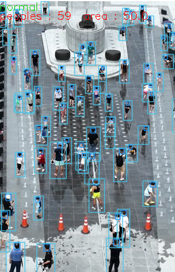

# 2022_Winter_CV_T2
### 팀원
- 김태윤(소프트웨어학부)
- 오용희(소프트웨어학부)
- 이강민(산업보안학과)
- 정다연(산업보안학과)


### :calendar: 회의 일정
|날짜|회의내용|
|:---|:----------------:|
|22/12/06| 첫 만남(대면) |
|22/12/26| 'Stable Diffusion 논문 구현' 주제 선정(비대면) |
|23/01/03| 'Stable Diffusion 논문' 리뷰 및 관련 내용 공유(대면) |
|23/01/04| '밀집도 측정을 통한 공공장소 안전사고 예방(가제)'으로 주제 변경(비대면) |
|23/01/11| 밀집도 측정을 위한 방법론 토의(비대면) |
|23/01/16| object detection, segmentation 쪽 조사로 역할 분담(대면) |
|23/01/20| object detection, segmentation 결과 공유(비대면) |
|23/01/27| 면적을 특정할 수 있는 상황으로 제한, head detection 수행 및 데이터셋 수집해보기(대면) |
|23/01/29| 회의 예정(비대면) |


### Our Models


### Install
Before running this program, **please create a virtual environment by running the code below for a better execution environment.** 

```
$ git clone https://github.com/CUAI-CAU/2022_Summer_CV5.git
```

```python
$ conda create -n crowd_density python=3.7
$ conda activate crowd_density
$ pip install -r requirements.txt
```

This code was tested with `python 3.7`, `torch 1.7`

### Pretrained
you can download pretrained checkpoint [here](https://drive.google.com/file/d/1JMd6_RCucjx9ozuW4o0U1kt3TQJpaty4/view?usp=sharing)

### Demo

```python
python demo.py --weights head_yolo.pt --source test/ --area 50 --view-img
```

